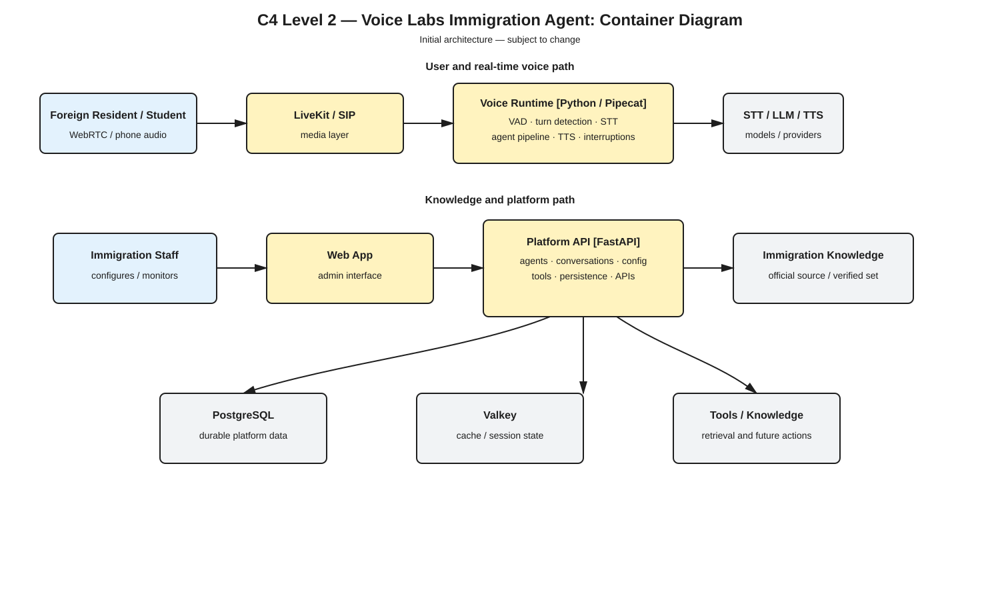

# Voice Labs

Voice Labs is our platform for building real-time multilingual Voice AI agents.

The goal is to build one reliable voice platform that can understand natural conversations across multiple languages — including people switching languages in the same conversation or sentence — and then adapt that platform to different use cases such as support, sales, booking, transportation, restaurants, healthcare, and call centers.

Instead of building a different voice system for every industry, we keep the core runtime reusable and customize each agent with its own instructions, tools, knowledge, integrations, and voice.

## How it works

```text
Speech In
    ↓
VAD / Turn Detection
    ↓
Speech-to-Text
    ↓
Agent / LLM
    ↓
Tools & Integrations
    ↓
Text-to-Speech
    ↓
Speech Out
```

Our first focus is getting the hard part right: **multilingual speech, code-switching, natural turn-taking, interruptions, and low latency**.

Initial language testing will focus on English, Russian, and Korean, including mixed combinations such as RU+EN, KO+EN, RU+KO, and three-language conversations.

## Stack

We reuse proven tools where they make sense and keep our own platform logic independent from individual providers.

Our initial stack includes:

* **FastAPI** — platform APIs and backend services
* **Pipecat** — real-time voice pipeline and orchestration
* **LiveKit** — WebRTC, real-time media, and SIP
* **Silero VAD** — voice activity detection
* **Smart Turn** — conversational turn detection
* **PostgreSQL** — primary database
* **Valkey** — cache and temporary session state
* **OpenTelemetry** — tracing and instrumentation
* **Prometheus + Grafana** — metrics and monitoring
* **Docker / Docker Compose** — local development and deployment

For STT, TTS, and LLMs we keep provider interfaces open. Current self-hosted candidates include **Qwen3-ASR**, **Chatterbox Multilingual**, and **Qwen models served through vLLM**, but these will be selected based on our own multilingual and latency benchmarks.

## Workspace

`stack.voice-labs` is the main workspace that brings the Voice Labs repositories together using Git submodules.

```text
stack.voice-labs/
├── services/
│   ├── platform/          # platform.voice-labs
│   └── runtime/           # runtime.voice-labs
│
├── apps/
│   └── web/               # web.voice-labs
│
├── infrastructure/        # infra.voice-labs
├── documentation/         # docs.voice-labs
├── research/              # evals.voice-labs
└── models/                # models.voice-labs
```

Each repository owns one part of the system and can be developed independently while still working together as one platform.

## Getting Started

### Requirements

Make sure you have:

```text
Git
Docker
Docker Compose
```

### Clone

Clone the workspace together with all submodules:

```bash
git clone --recurse-submodules git@github.com:<organization>/stack.voice-labs.git
cd stack.voice-labs
```

If you already cloned the repository without submodules:

```bash
git submodule update --init --recursive
```

Create your local environment file:

```bash
cp .env.example .env
```

Then start the local stack:

```bash
docker compose up --build
```

To update the workspace and its submodules later:

```bash
git pull
git submodule update --init --recursive
```

## Development Approach

Keep things simple and build around real requirements.

We prefer proven open-source tools over rebuilding solved infrastructure, but Voice Labs itself remains our platform. STT, TTS, LLM, telephony, and other providers should stay replaceable, and we avoid adding microservices or infrastructure until there is a real reason for them.

The priority is clean code, clear ownership, low latency, measurable performance, and an architecture that can grow without forcing us to rewrite the core system.

## Project Documentation

### C4 Level 1 — System Context

<a href="./docs/architecture/c4-context.svg"></a>

### C4 Level 2 — Container Diagram

<a href="./docs/architecture/c4-container.svg"></a>

- [Data Sources](docs/DATA_SOURCES.md)
- [Test Plan](docs/TEST_PLAN.md)

## Team

Authors, GitHub handles, and role ownership are tracked in [`AUTHORS.yml`](AUTHORS.yml).

| Name | GitHub | Responsibilities |
|------|--------|------------------|
| Abdilazhanov Bekbolot | [@abdibekbolot](https://github.com/abdibekbolot) | AI / engineering, models and workflow |
| Aiymzhan Doskempirova | [@aimzhandos67](https://github.com/aimzhandos67) | Data research, presentation and demo video |
| Dayan Dayerbekova | [@avokebryad-svg](https://github.com/avokebryad-svg) | Team representative, value proposition |
| Milana Baibalaeva | [@milana2811](https://github.com/milana2811) | Project submissions and deadlines, minute taker |
| Bekali | [@qrtman](https://github.com/qrtman) | AI / engineering, data research |
| Aidar | [@Raidnk](https://github.com/Raidnk) | AI / engineering |
